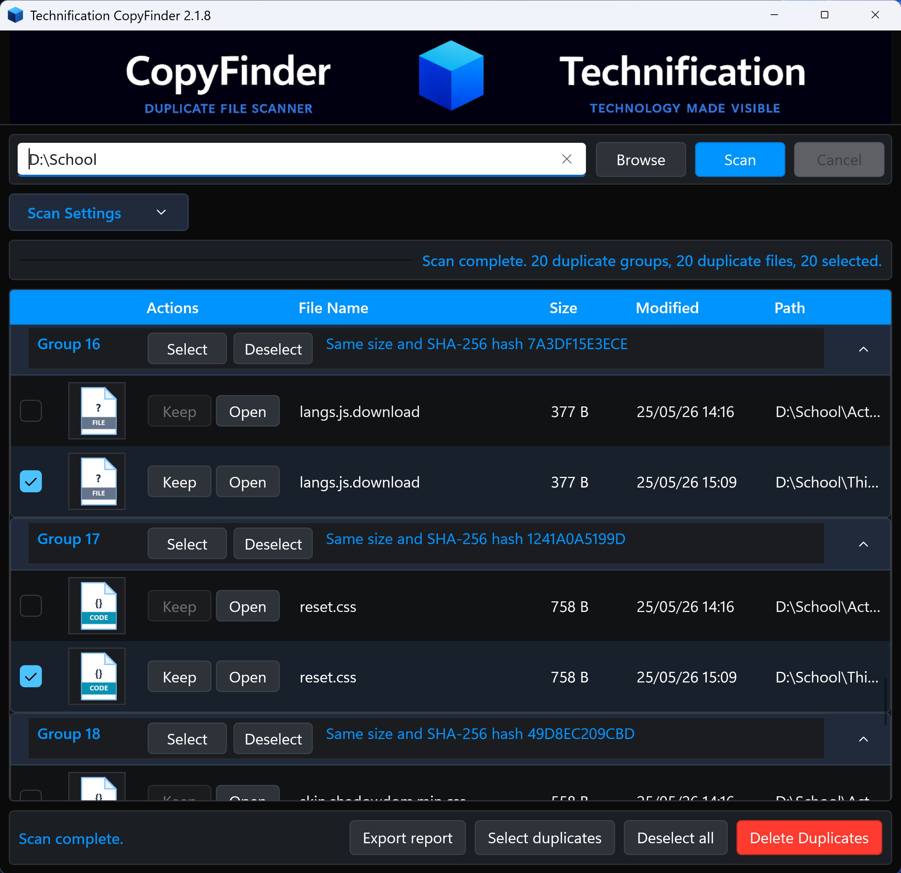

# CopyFinder


A WinUI 3 desktop app for finding duplicate files in a selected directory.



## 📜 Application Behaviour

- Scans subfolders recursively.
- Groups duplicates by file size first.
- Hashes only same-size files with SHA-256.
- Marks one file in each group as `Keep` using the selected keep rule.
- Moves selected duplicates to the Windows Recycle Bin.
- Stops each scan after the configured duplicate file count. The default is 500.
- Let's you manually choose the kept file inside a duplicate group.
- Opens a file location from the review grid.
- Deployment logs `%ProgramData%\CopyFinder\Logs\deployment.log`  

[REPO_LAYOUT.md](REPO_LAYOUT.md) - Repository directory map.  
[INSTALL.md](INSTALL.md) - install instruction.

## 📦 Build

### Requirements

- Windows 11
- Windows SDK 10.0.26100.0
- .NET 10 SDK.

Run from the application  

```powershell
dotnet build
```

## 📦 Test

Run the focused regression harness:

```powershell
dotnet run --project Tests\CopyFinder.Tests.csproj
```

## 📦 Run

```powershell
dotnet run
```

## 📦 Publish

Create a standalone runnable app folder and zip for testing:

```powershell
.\publish.ps1
```

The app is published to `publish\CopyFinder-Standalone`.
Run `CopyFinder.exe` from that folder or send the generated standalone zip to a test machine.
The publish script clears the output folder first so stale files are not carried forward.
Debug symbol files are excluded from the normal standalone zip. Use `.\publish.ps1 -IncludeDebugSymbols` for internal diagnostic builds.

## 🕹️ Deployment Safety

CopyFinder uses `SafeFile` for protected file operations. The layer logs CFA status, possible CFA blocks, OneDrive locks/fallback copies, permission checks, read-only attribute changes, ownership-repair attempts, and delete failures to `%ProgramData%\CopyFinder\Logs\deployment.log`.

If Controlled Folder Access blocks the app, allow this exact executable path from the published folder:

```powershell
Add-MpPreference -ControlledFolderAccessAllowedApplications "C:\Path\To\CopyFinder.exe"
```

Normal UI deletes do not silently take ownership. Enterprise deployments that need ownership repair should run CopyFinder elevated or add a dedicated SYSTEM helper service for approved remediation.

## 📝 Credits

Created by **Dean John Weiniger**.  

## 📜 Licence

This work is dedicated to the public domain under the **Creative Commons CC0 1.0 Universal License**.  
[](https://creativecommons.org/publicdomain/zero/1.0/)  

**You are free to:**  
✅ **Share** – Copy and redistribute the material in any medium or format.  
✅ **Adapt** – Remix, transform, and build upon the material for any purpose, even commercially.  
✅ **Use without attribution** – No credit required, though it’s appreciated.

**No conditions apply:**  
🚫 No attribution required.  
🚫 No restrictions on use.  
**Full licence text:** [CC0 1.0 Universal](https://creativecommons.org/publicdomain/zero/1.0/)  

---

### updated: 30-06-2026
